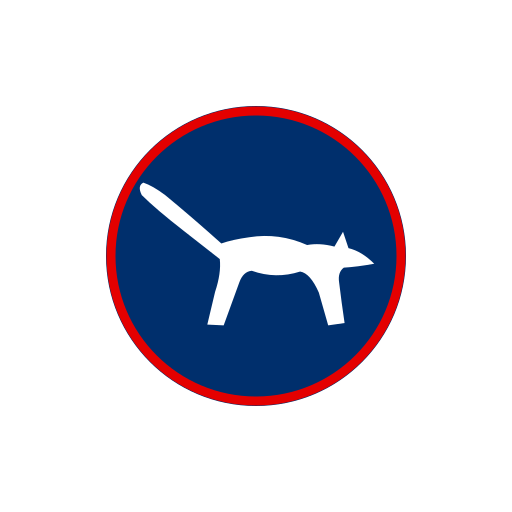
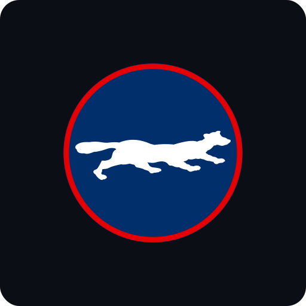
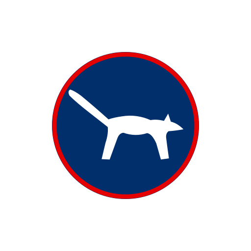

# Mediakit — airKUNA

Službeni brand resursi projekta **airKUNA** — reguliranog euro stablecoina za hrvatsko i EU tržište.

<p align="center">
  
  &nbsp;&nbsp;
  
  &nbsp;&nbsp;
  
  &nbsp;&nbsp;
  
</p>

## O repozitoriju

Repozitorij sadrži službeni logotip airKUNA — u vektorskom (SVG) i rasterskom (PNG) formatu, u više varijanti. Iste vektorske datoteke koriste se **cross-document**: u pitch-decku, dokumentaciji, na webu i kao on-chain token ikona. Time je vizualni identitet standardiziran iz jednog izvora istine.

Namijenjen je novinarima, partnerima, integratorima (burze, novčanici, blok-exploreri) te svima koji žele referencirati ili prikazati airKUNA u izvornom, neizmijenjenom obliku.

## Brand sustav

- **Kuna (marten)** — bijela silueta kune u trku, omaž **starim hrvatskim kovanicama** (kuna je bila na novčanicama i kovanicama; kuna kao životinja je i etimološki korijen imena valute — krzno kune bilo je srednjovjekovno sredstvo plaćanja). Životinja, a ne tuđi simbol, nosi identitet.
- **Novčić** — tamnoplavi disk (`#002F6C`) na kojem kuna stoji, evocira kovanicu.
- **Crveni rub** — Aircash-crveni (`#E40000`) rub novčića. Crvena je zajednička točka Aircash brenda i hrvatske zastave.
- **Bijela pozadina sa zaobljenim kutovima** — radijus 32 na platnu 512 × 512 (varijanta `dark` ima tamnu pozadinu `#0B0E14`).

### Paleta boja

Paleta spaja **Aircash** i **Domovina** brand boje — crvena im je zajednička, navy dolazi iz hrvatske zastave / Domovina sustava:

| Naziv | HEX | Izvor | Uloga |
|---|---|---|---|
| Navy (tamnoplava) | `#002F6C` | Domovina / HR zastava | Novčić, silueta kune (mono), obris |
| Crvena | `#E40000` | Aircash (Pantone 1795 C) | Rub novčića, akcent |
| Bijela | `#FFFFFF` | — | Pozadina, silueta kune na novčiću |
| Tamna (near-black) | `#0B0E14` | — | Pozadina `dark` varijante |

> Ista paleta koristi se i u pitch-decku (`github.com/airkuna/pitch-deck`) — boje su namjerno usklađene preko svih materijala.

## Varijante

### airKUNA — primarni logo


Osnovna varijanta za svijetle pozadine. Bijela pozadina sa zaobljenim kutovima, tamnoplavi novčić, Aircash-crveni rub i bijela silueta kune. Zadana opcija za većinu primjena.

<br clear="left">

### airKUNA — tamna pozadina


Varijanta za tamne podloge (tamne prezentacijske slajdove, društvene mreže, naslovnice). Tamna pozadina, navy novčić s crvenim rubom i bijela silueta kune.

<br clear="left">

### airKUNA — token ikona


Prozirna pozadina, bez okvira. Bez bijelog okvira — novčić (s rubom i kunom) na prozirnoj podlozi. Namijenjena prikazu KUNA tokena u novčanicima, na burzama, blok-explorerima i u grafovima — gdje se ikona prikazuje kao krug na proizvoljnoj podlozi.

<br clear="left">

### airKUNA — monokromatski


Jednobojna (navy) linijska verzija za tisak u jednoj boji, pečate, vodene žigove i faksimile, gdje boje nisu dostupne ili nisu poželjne.

<br clear="left">

## Datoteke

| Varijanta | Vektor (SVG) | Raster (PNG, 2048 × 2048) |
|---|---|---|
| Primarni logo | [`airkuna_logo_square.svg`](airkuna_logo_square.svg) | [`airkuna_logo_square.png`](airkuna_logo_square.png) |
| Tamna pozadina | [`airkuna_logo_square_dark.svg`](airkuna_logo_square_dark.svg) | [`airkuna_logo_square_dark.png`](airkuna_logo_square_dark.png) |
| Token ikona | [`airkuna_token_icon.svg`](airkuna_token_icon.svg) | [`airkuna_token_icon.png`](airkuna_token_icon.png) |
| Monokromatski | [`airkuna_mono_square.svg`](airkuna_mono_square.svg) | [`airkuna_mono_square.png`](airkuna_mono_square.png) |

**Preporuka:** koristite SVG kad god je moguće — vektor ostaje oštar na bilo kojoj veličini. PNG koristite samo ondje gdje SVG nije podržan.

## Generiranje PNG-ova iz SVG-a

Svi PNG-ovi generirani su iz SVG izvora pomoću [`rsvg-convert`](https://wiki.gnome.org/Projects/LibRsvg) (paket `librsvg`):

```bash
# instalacija (macOS)
brew install librsvg

# generiranje svih varijanti na 2048 × 2048
./build.sh

# ili druga veličina (npr. 1024)
./build.sh 1024
```

## Pravila korištenja

- **Bez izmjena.** Logotip se ne smije mijenjati — zabranjene su izmjene boja, proporcija, rotacija, dodavanje efekata ili teksta.
- **Bez izvedenih verzija** koje bi mogle izazvati zabunu s brendom ili sugerirati partnerstvo, sponzorstvo ili odobrenje koje ne postoji.
- **Sigurnosni prostor.** Oko logotipa ostavite slobodan prostor jednak najmanje 1/8 njegove visine.
- **Minimalna veličina.** Ne koristite manji od 24 × 24 px — silueta kune ispod te veličine postaje nečitljiva.
- **Pozadina.** Primarna i monokromatska varijanta imaju bijelu pozadinu; za tamne podloge koristite `dark` varijantu; za proizvoljne podloge token ikonu.

## Licenca

Sadržaj ovog repozitorija (logotipi, izvorne datoteke i dokumentacija) licenciran je pod **[Creative Commons Attribution-NoDerivatives 4.0 International (CC BY-ND 4.0)](https://creativecommons.org/licenses/by-nd/4.0/deed.hr)**.

Smijete **dijeliti** (kopirati i redistribuirati u bilo kojem mediju ili formatu, uključujući komercijalnu upotrebu) uz **atribuciju** i **bez prerada** (izmijenjeni materijal ne smijete distribuirati). Puni tekst: [`LICENSE`](LICENSE).

## O brendu i nazivima

**airKUNA** je projekt u ranoj fazi. Iza naziva **„airKUNA"** i **„KUNA"** (kao naziv tokena) zasad **ne stoji registrirana pravna osoba ni registrirani žig** — riječ je o radnim nazivima projekta.

Napomena: Hrvatska je u eurozoni od 1. 1. 2023.; kuna više ne postoji kao valuta. „KUNA" je ovdje **brand** (digitalni hrvatski euro), a underlying vrijednost tokena je **euro**. Naziv se ne koristi kao tvrdnja o postojećoj valuti.

CC BY-ND 4.0 odnosi se na autorska prava na grafičkom djelu; ne treba je tumačiti kao dopuštenje za preuzimanje naziva ili logotipa kao identiteta nekog drugog proizvoda. Ako razvijate nešto u srodnom prostoru, **javite se prije** korištenja.
